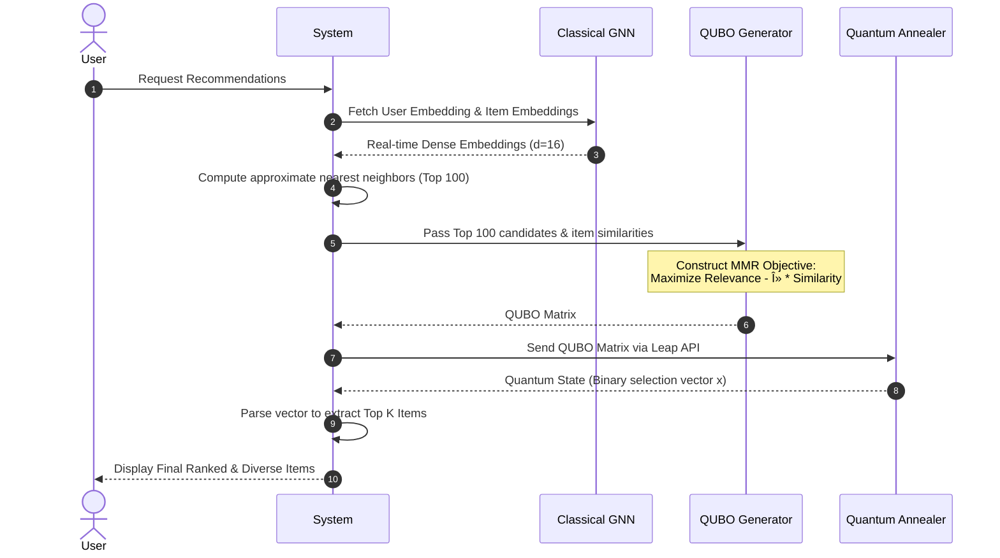

# Phase 1: System Architecture & Methodology Flow

This document outlines the detailed system architecture and data flow for the **Classical-GNN Quantum-Ranking Hybrid (CG-QRH)** system. It translates the theoretical proposed methodology into concrete system components for Phase 1 of our project.

## 1. High-Level Architecture

The system is decoupled into two primary execution layers: a Classical Layer for representation learning and a Quantum Layer for combinatorial optimization.

```mermaid
flowchart TD
    %% Define Data Sources
    subgraph Data Layer
        A1[Amazon All_Beauty]
        A2[RetailRocket]	
        DP[Data Processing Pipeline]
        A1 --> DP
        A2 --> DP
        DP --> |Bipartite Graph| G(Graph Storage)
    end

    %% Classical Candidate Generation
    subgraph Classical Layer: Candidate Generation
        G --> L(LightGCN Model)
        L --> |User/Item Embeddings| E(Embedding Store)
        E --> ANN(ANN Search - FAISS)
        ANN --> |Top 100 Candidates| C(Candidate Pool)
    end

    %% Quantum Optimization
    subgraph Quantum Layer: Combinatorial Ranking
        C --> QM(QUBO Matrix Generator)
        QM --> |QUBO Formulation| D(D-Wave / QAOA)
        D --> |Top K Diverse Items| R(Final Recommendations)
    end

    Data Layer --> Classical Layer: Candidate Generation
    Classical Layer: Candidate Generation --> Quantum Layer: Combinatorial Ranking
```

## 2. Methodology Flow

The exact sequence of operations for generating a recommendation for a single user.



## 3. Component Details

### A. Data Prep & Input Modeling (`src/data_processing/`)
* **Input**: Highly sparse raw data (JSONL, CSV).
* **Processing**: 
  * Remove users/items with < 5 interactions (k-core filtering) to ensure sufficient signal for the GNN.
  * Map raw IDs to contiguous integer IDs.
  * Construct PyTorch Geometric `HeteroData` or `Data` objects representing the User-Item bipartite graph.
  * Generate negative samples for classical training (BPR Loss).

### B. Classical Architecture (`src/classical_models/`)
* **Model**: LightGCN (Graph Convolutional Network without non-linear activation or feature transformation, optimal for collaborative filtering).
* **Objective**: Bayesian Personalized Ranking (BPR) Loss.
* **Outputs**: Dense vector representations for all users and items.
* **Serving**: FAISS (Facebook AI Similarity Search) index to rapidly retrieve the top 100 candidate items (maximizing Relevance) given a user embedding.

### C. Quantum Architecture (`src/quantum_models/`)
* **Model**: Maximum Marginal Relevance (MMR) formulated as a Quadratic Unconstrained Binary Optimization (QUBO) problem.
* **Objective Function**: $\min_x \left( - \sum_i R_i x_i + \lambda \sum_{i,j} S_{ij} x_i x_j \right)$
* **Inputs**:
  * $R_i$: Relevance score (dot product of User and Item $i$ embedding).
  * $S_{ij}$: Similarity score (cosine similarity between Item $i$ and Item $j$ embeddings).
  * $x_i \in \{0,1\}$: Binary decision variable (1 if selected, 0 otherwise).
  * $\lambda$: Penalty weight for diversity.
* **Execution**: D-Wave Quantum Annealer via the Ocean SDK (`dwave-system`).

### D. Verification & Metrics (`src/evaluation/`)
* **Ranking Quality**: Normalized Discounted Cumulative Gain (NDCG@K) and Hit Ratio (HR@K) to ensure we don't lose accuracy during the quantum ranking.
* **Diversity Quality**: Intra-List Diversity (ILD) and Catalog Coverage to prove the quantum component successfully increases diversity.
* **System Metrics**: Quantum Annealing time, QPU Access time, and end-to-end latency.
